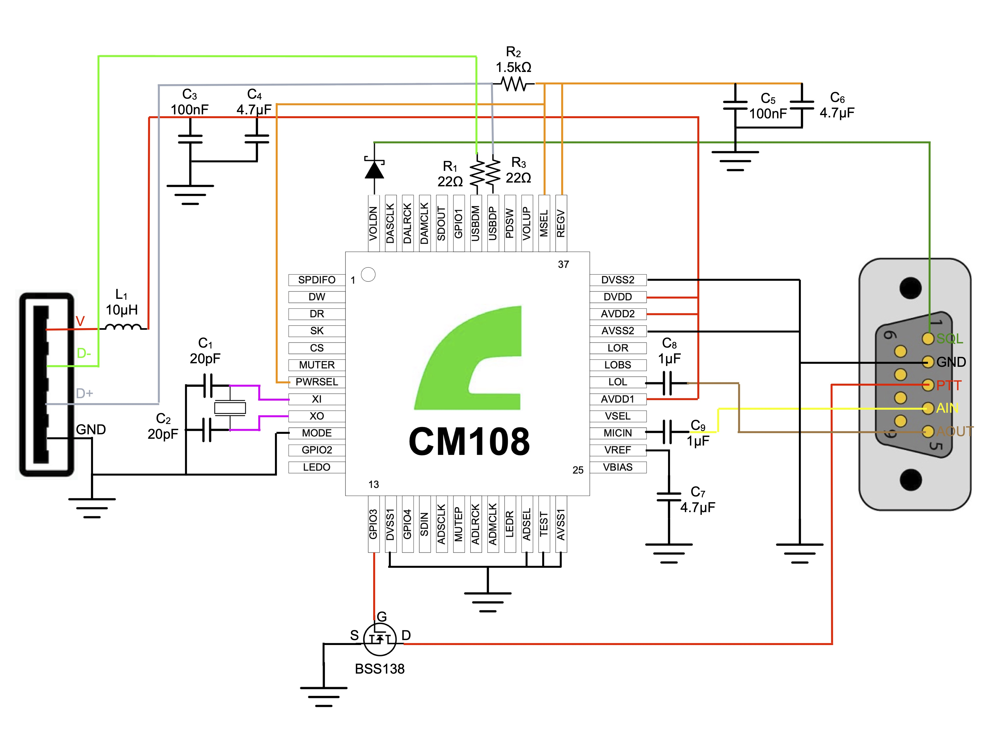

# USBRadio

USBRadio is a **CM108-based USB radio interface** designed to provide audio and control lines on a compact board for connecting a radio transceiver to a computer.

This project was developed to make this interface suitable for use with **AllStarLink** and **EchoLink** nodes, where reliable USB audio, **PTT** control, and **SQL/squelch** signaling are commonly required.

## Diagram

## Overview

The core of the design is the **CM108/CM108B** USB audio interface chip. The board is intended to integrate the typical signals needed between a PC and an external radio, including:

- USB connection to the host computer
- Audio input from the radio
- Audio output to the radio
- **PTT** control
- **SQL / Squelch** input
- Power filtering and support circuitry

From the schematic, the radio-side connections include:

- **SQL**
- **GND**
- **PTT**
- **AIN**
- **AOUT**

## Main use case

This hardware is especially intended as a compact interface for radio systems connected to:

- **AllStarLink nodes**
- **EchoLink nodes**
- other USB-to-radio audio/PTT applications

It can be used as a starting point for custom node interfaces, radio adapters, and amateur radio integration projects.

## Notes

At the moment, this repository mainly contains the essential **hardware design files**. No firmware, host software, or detailed assembly guide is included.

Before manufacturing or connecting the board to an actual radio, it is recommended to verify:

- audio levels
- PTT logic
- radio connector pinout
- electrical and mechanical compatibility with the target device

## License

This project is released under the **MIT License**.

See the [LICENSE](LICENSE) file for details.
